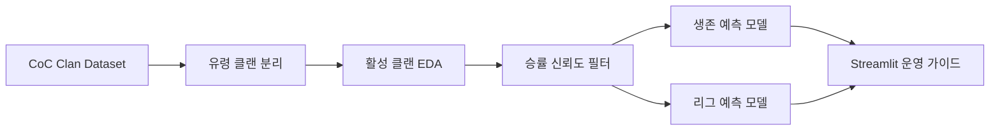

# Clash of Clans Clan ML Prediction

> 355만 건의 클랜 데이터를 그대로 모델링하지 않고, **유령 클랜 분리와 승률 신뢰도 검증**을 먼저 수행한 클랜 운영 분석 프로젝트

## 이 프로젝트가 답하려 한 질문

Clash of Clans에서 클랜은 신규 유저가 게임에 정착하는 중요한 단위입니다. 하지만 비활성 클랜에 들어가면 지원을 받지 못하고 이탈할 가능성이 커집니다. 클랜장 입장에서도 어떤 클랜이 유지될 가능성이 높은지, 어떤 조건을 바꾸면 성장 가능성이 높아지는지 감각만으로 판단하기 어렵습니다.

이 프로젝트는 단순히 “모델 정확도를 높이는 것”이 아니라 **클랜장이 실제로 바꿀 수 있는 운영 기준을 데이터로 찾는 것**을 목표로 했습니다.

| 핵심 관점 | 정리 |
| --- | --- |
| 원천 데이터 | Kaggle 기반 CoC 클랜 데이터 3,559,743 rows |
| 첫 번째 문제 | 전체의 90.5%가 비활성에 가까운 유령 클랜 |
| 분석 전환 | 전체 클랜 모델링 → 활성 클랜 운영 문제로 재정의 |
| 검증 기준 | 유령 클랜 분리, `war_total >= 20` 승률 신뢰도 필터, 누수 변수 제거 |
| 결과 활용 | 모집 인원, 요구 트로피, 목표 리그를 조정하는 운영 가이드 |

## 문제 정의


## 기획과 판단 기준

처음에는 전체 클랜을 한 번에 모델링하려고 했습니다. 하지만 데이터를 확인하니 `3,222,737개`, 즉 전체의 `90.5%`가 활동 흔적이 거의 없는 유령 클랜이었습니다. 이 상태로 모델을 만들면 “대부분의 클랜은 비활성”이라는 당연한 결과만 강해지고, 클랜장이 실제로 개선할 수 있는 기준은 나오기 어렵다고 봤습니다.

그래서 분석의 출발점을 바꿨습니다. 먼저 유령 클랜을 분리하고, 활성 클랜 안에서 생존 가능성과 리그 성장 가능성을 따로 봤습니다. 승률도 그대로 믿지 않았습니다. 100% 승률 클랜 중 전쟁을 `1~3판`만 치른 표본이 많았기 때문에, `war_total >= 20` 기준을 적용해 우연히 좋아 보이는 성과를 줄였습니다.

## 데이터 신뢰도 기준

| 검증 항목 | 적용 기준 | 판단 이유 |
| --- | --- | --- |
| 유령 클랜 분리 | `num_members < 5`, `war_total == 0`, `clan_capital_points == 0` 등 | 비활성 표본이 모델 결과를 지배하지 않도록 분리 |
| 승률 검증 | `war_total >= 20` | 1~3판 100% 승률 표본이 성과를 왜곡할 수 있음 |
| 생존 타깃 | `clan_capital_points > 0` | 실제 활동 흔적으로 해석 가능한 지표 |
| 누수 점검 | 초기 AUC 1.0000 구간 재검토 | 결과와 직접 연결된 변수가 섞였을 가능성 제거 |
| 불균형 대응 | SMOTE와 Optuna 비교 | 소수 리그를 완전히 놓치지 않는 모델 우선 |

## 모델링을 사용한 이유

모델은 클랜을 점수화하기 위한 장식이 아니라, **운영 기준을 수치로 확인하기 위한 도구**로 사용했습니다. 생존 예측 모델은 이탈 위험이 큰 클랜을 먼저 찾는 데 초점을 두었고, 리그 예측 모델은 정확히 한 티어를 맞히는 것보다 현실적인 목표 범위를 제시하는 데 초점을 두었습니다.

특히 리그 예측에서는 단일 티어 정확도보다 `±1 티어 허용 정확도`를 더 중요하게 봤습니다. 클랜장에게 필요한 것은 “정확히 Crystal II” 같은 예측보다, 현재 조건에서 어느 범위까지 성장 가능성이 있는지와 무엇을 보완해야 하는지에 가까웠기 때문입니다.

## 시스템 흐름




## 차별점

| 흔한 접근 | 이 프로젝트의 관점 |
| --- | --- |
| 전체 데이터를 그대로 모델에 넣고 성능을 비교 | 유령 클랜 90.5%를 먼저 분리해 분석 대상을 재정의 |
| 승률을 그대로 성과 지표로 사용 | 전쟁 수가 적은 100% 승률 표본을 의심하고 최소 표본 기준 적용 |
| 높은 AUC를 성과로 받아들임 | AUC 1.0000 구간에서 데이터 누수를 의심하고 피처를 다시 구성 |
| 리그 예측을 단일 정답 맞히기로 해석 | 클랜장이 참고할 수 있는 ±1 티어 목표 범위로 해석 |
| 분석 결과가 모델 수치에서 끝남 | `11명 이상 활동 인원 확보`, 요구 트로피 조정 같은 운영 액션으로 연결 |

## 주요 결과

| 항목 | 결과 | 해석 |
| --- | --- | --- |
| 유령 클랜 비율 | `90.5%` | 원본 전체 모델링보다 활성 클랜 재정의가 먼저 필요 |
| 승률 재검증 | 100% 승률 중 1~3판 표본 `12,898개` | 승률 지표에는 최소 전쟁 수 기준이 필요 |
| 생존 예측 | AUC `0.8911`, F1 `0.8582` | 위험 클랜 조기 식별 가능 |
| 리그 예측 | ±1 티어 정확도 `97.88%` | 현실적인 목표 리그 범위 제시에 적합 |
| 운영 인사이트 | 11명 이상 활동 인원 확보 | 초반 생존 안정화의 1차 목표로 해석 |

## 산출물과 실행

| 항목 | 경로 |
| --- | --- |
| 보고서 | [결과보고서 PDF](docs/reports/결과보고서(클래시오브클랜%20게임%20데이터%20분석).pdf) |
| EDA 노트북 | `notebooks/01_EDA_Model_A.ipynb` |
| 모델링 노트북 | `notebooks/02_Modeling_Model_B.ipynb` |
| Streamlit 앱 | `src/app_unified.py` |

```bash
uv run streamlit run src/app_unified.py
```

## 한계와 다음 개선

- 단일 시점 데이터라 순수한 리텐션·생존분석까지는 연결하지 못함
- 클랜 채팅, 가입·탈퇴 로그, 시즌별 스냅샷이 있으면 더 실제 행동에 가까운 모델링 가능
- 다음 단계에서는 SHAP 설명 결과를 클랜장용 알림·추천 룰로 연결할 수 있음

> 성능 수치는 노트북 실행 결과 기준이며, 데이터 버전과 재학습 조건에 따라 달라질 수 있습니다.
